# Portfolio redesign research handoff

Research date: 4 October 2026. **Historical research captured before the implemented redesign; descriptions of the old site are not current.**

## Recommendation

Explore a **product-focused technical portfolio** first: retain the near-black/off-white palette, violet accent, scene numbers and distinctive identity, but introduce the work sooner and make each project understandable through real evidence. Use Linear for product framing, Emil Kowalski for content hierarchy, and Rauno Freiberg for a small dose of playful personality. A quiet editorial direction and a visual lab direction remain valid alternatives below. This is a recommendation, not an approved design.

## What is on the current site

Inspected [the live portfolio](https://aoyn1xw.github.io/) using Codex’s in-app browser, including navigation, scrolling, and the separate commission page. Screenshots are local files under `assets/`; they show captured viewports, not complete pages or proposed designs.

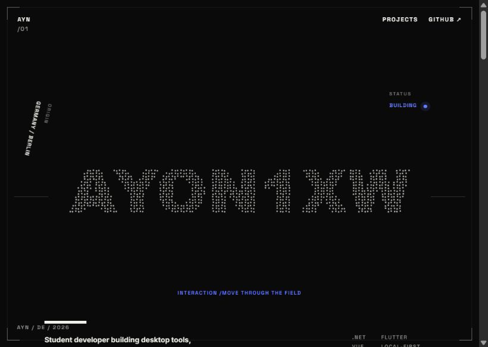

The current sequence is:

1. Particle-style AYON1XW wordmark, Germany/Berlin metadata, Building status, student-developer introduction and .NET/Flutter/Vue/local-first stack.
2. Profile: practical tools that begin with a personal need.
3. ShadowPlay: real mobile screenshots, Windows host/Flutter client, private LAN clip discovery and original-file download. Presented as an active MVP.
4. Swift Devcontainer, IPA Signer and Untis Watcher in a numbered repository index.
5. Contact through GitHub, socials, commissions and terms.

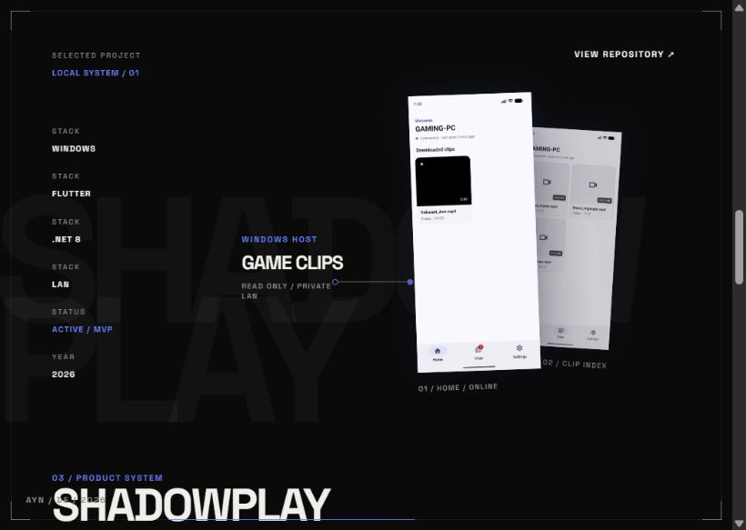

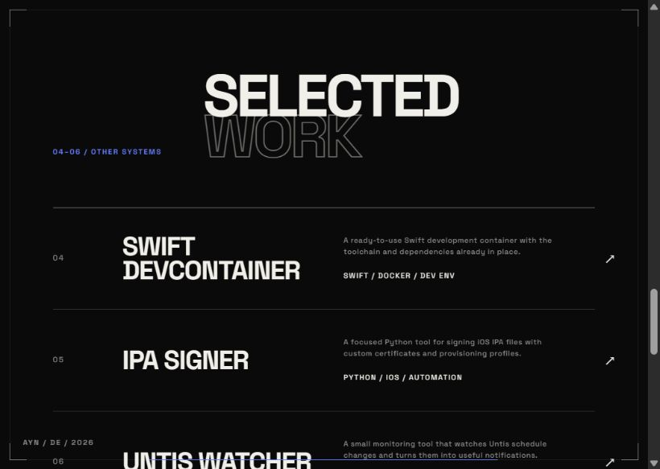

The [commission page](https://aoyn1xw.github.io/commissions.html) contains scope boundaries, eight process checkpoints, payment/delivery/revision information, a terms link and a Telegram-oriented request form. Keep its meaning intact in any later visual redesign. Current fields are Telegram username, project description, optional deadline, optional reference URLs and two required acknowledgements. The page states that requests are sent privately to Telegram and not intentionally stored in a website database; this research did not independently audit the backend.

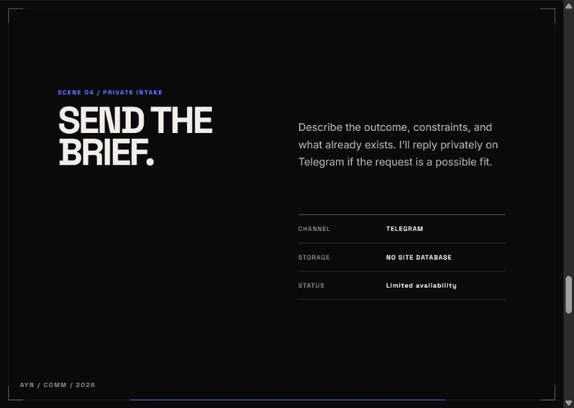

### Interaction evidence and limits

| Action | Observed result |
| --- | --- |
| Click Projects | URL changed to `#projects`, with the selected-work index visible |
| Scroll through homepage | Profile and ShadowPlay composition visible |
| Click Commissions | Separate commission document opened |
| Click Request | URL changed to `#request`; request section present in accessibility state |
| Enter temporary project description | Counter showed 52 / 3000 characters |
| Clear temporary description | Counter returned to zero and minimum-50-character feedback appeared |
| Submit / accept terms | Not performed |

No form transmission, repository-link destination audit, mobile breakpoint test, performance measurement, or accessibility certification was performed. The particle field was visually inspected; pointer/touch animation behavior was not fully tested. Screenshots may capture intermediate animation states.

### Strengths worth preserving

- Recognizable typographic identity and a disciplined palette.
- Real product screenshots rather than stock imagery.
- Honest student-developer positioning and concrete tool descriptions.
- A clear distinction between a commission request and an accepted job.
- Compact repository rows that suit tools without rich visual assets.

### Design opportunities — judgment, not measured defects

- The identity scene occupies most of the initial viewport; the explanatory introduction sits near its lower edge. Test a version with the introduction and a visible Work action higher up.
- ShadowPlay’s tilted, overlapping screenshots create atmosphere but make comparison harder. Try one legible main screenshot plus supporting details.
- Projects currently jumps to the secondary index. A future Work destination should include the featured project too.
- Some metadata is visually small and dim in the captured viewport. Enlarge the information needed to understand the work; keep microtype for supporting labels.
- Full-height scenes make a strong presentation but delay scanning. Give projects content-driven heights.
- Most project actions lead straight to GitHub. A short on-site problem → solution → evidence summary could help visitors before they leave.

## Reference board

Borrow principles and interaction patterns; retain original copy, project facts and owned screenshots. These reference images are research evidence, not assets for publication in the redesigned site. Respect their owners’ rights and check font/media licensing separately.

### 1. Linear — product framing

[Live homepage](https://linear.app/) · Captured and interacted with on 4 October 2026.

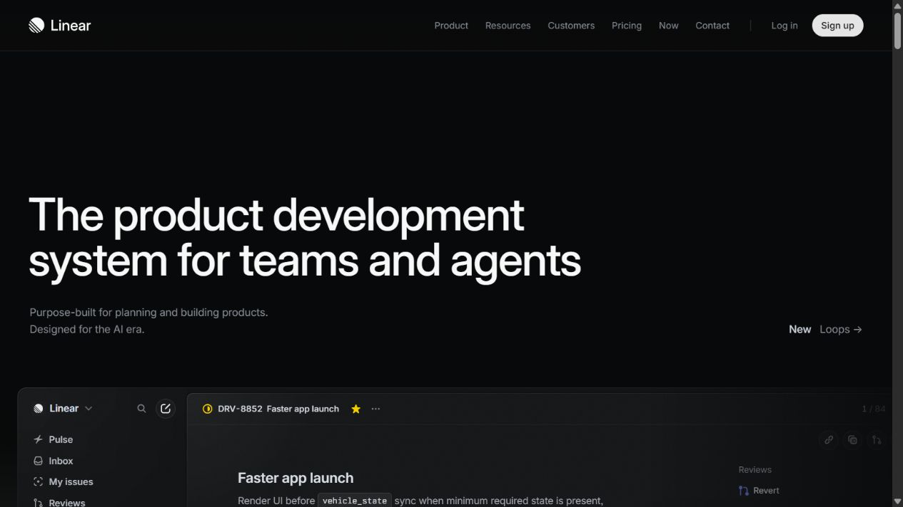

**Observed:** dark surfaces, large left-aligned value statement, restrained supporting copy, prominent product UI and thin rules. The Product button expanded a menu containing grouped, descriptive destinations.

**Borrow:** put a clear outcome next to a legible screenshot; use a restrained type hierarchy; let product evidence provide the visual richness.

**Apply here:** ShadowPlay gets a short outcome statement, its two real mobile screens, a simple PC → LAN → phone explanation, and a repository action. Any demo/download action needs a verified destination first.

**Avoid:** enterprise customer logos, marketing claims, the enormous feature catalogue, or a multi-column mega-menu for four projects.

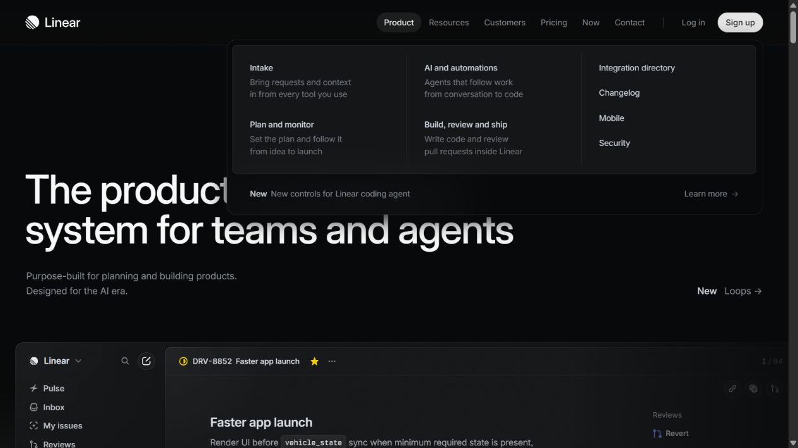

### 2. Emil Kowalski — quiet content hierarchy

[Live portfolio](https://emilkowal.ski/) · Browser inspection plus Context.dev styleguide extraction.

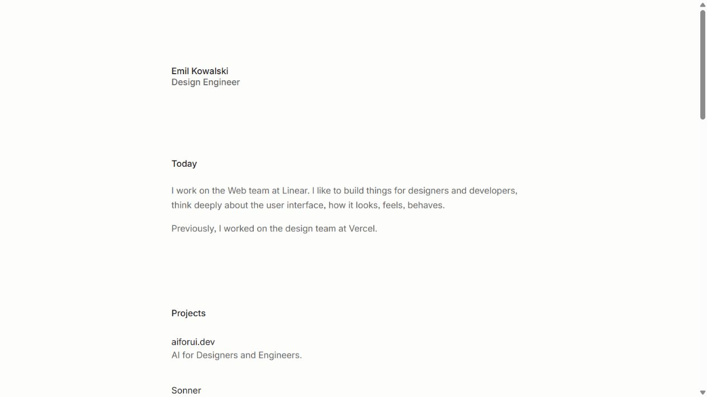

**Observed:** a narrow readable column, light background, compact identity, clear Today/Projects/Writing groups and project names paired with one-line descriptions. The top promotional notice reported that early access had closed; it is not part of the recommended structure.

**Borrow:** direct descriptions, comfortable reading width, a short project list, and optional writing as proof of thoughtfulness.

**Apply here:** use this clarity for the profile, smaller projects and commission guidance. Add build notes only if real material exists.

**Avoid:** copying the author’s credentials, professional history or writing titles. A completely plain list may undersell the existing ShadowPlay visuals.

Context.dev returned background `#fdfdfc`, text `#21201c`, accent `#fad657`, body 14px/23.1px and spacing examples 4/12/24/64/128px. These are automated extraction results, not a manually verified exhaustive design system. Its “Sans” label does not establish a reusable font license. Use the color relationship and spacing rhythm as inspiration rather than importing its custom font files.

### 3. Rauno Freiberg — personality and compact discovery

[Live portfolio](https://rauno.me/) · [Project index](https://rauno.me/projects).

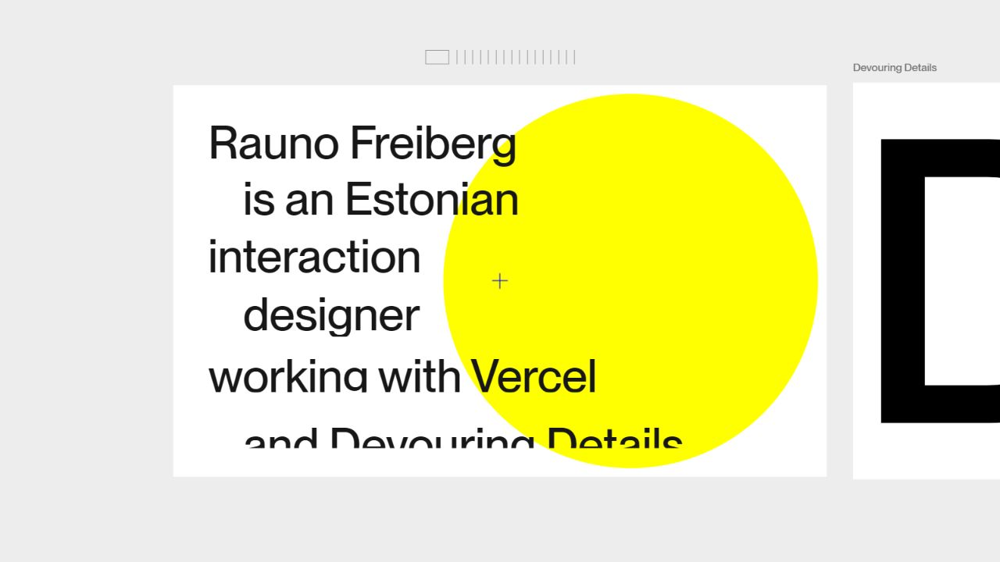

**Observed:** a horizontal, poster-like composition, oversized identity text, a strong yellow circular accent and links to craft, projects and notes. Clicking Projects opened a compact ruled list with years. Text was animated/scrambling during captures, so the screenshot is an interaction-state sample, not a final static layout.

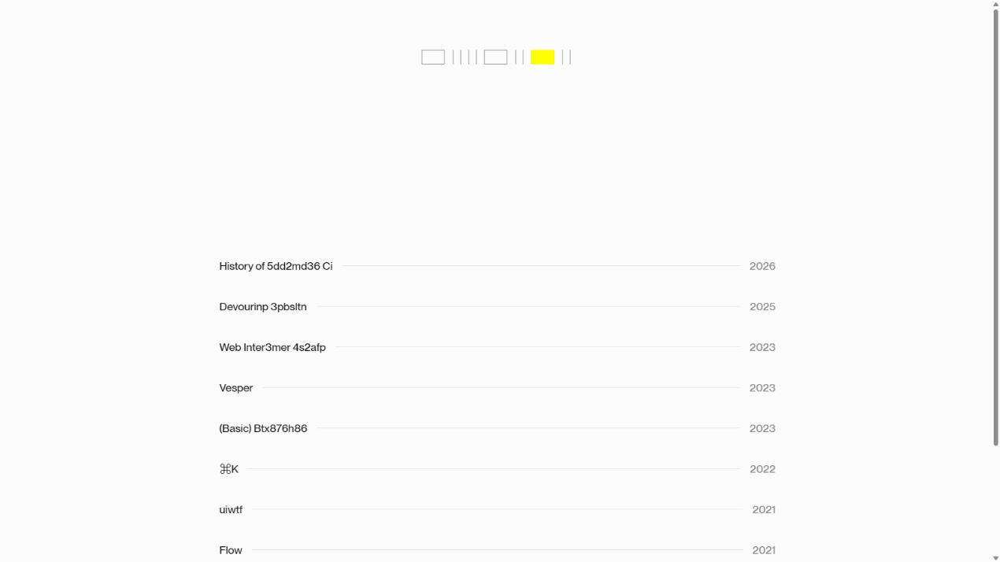

**Borrow:** one memorable identity moment, followed by a simple information structure; fine rules and year metadata for a project archive.

**Apply here:** keep the particle wordmark as an optional flourish, with an always-readable text introduction and ordinary project links.

**Avoid:** making horizontal exploration, animated text or hover the only way to discover essential information. The current portfolio should remain understandable on touch and with reduced motion.

### 4. Back of the House — selected work versus index

[Live studio portfolio](https://backofthehouse.com/) · [HOVERSTAT.ES feature](https://www.hoverstat.es/features/back-of-the-house/).

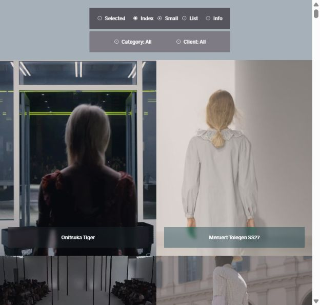

**Observed live:** a small floating navigation, Selected/Index/Info choices, image-led grid, Small/List options and Category/Client controls. Clicking Index exposed project imagery and captions. Initial media loading briefly left most of the viewport empty.

**Borrow:** separate a visual selected-work presentation from a utilitarian archive. Let media captions carry context.

**Apply here:** one featured ShadowPlay story followed by the compact tools index. No filtering needed for the current small collection.

**Avoid:** large video downloads, tiny floating-only navigation, or inventing imagery for command-line projects. Its fashion imagery is not transferable to this portfolio.

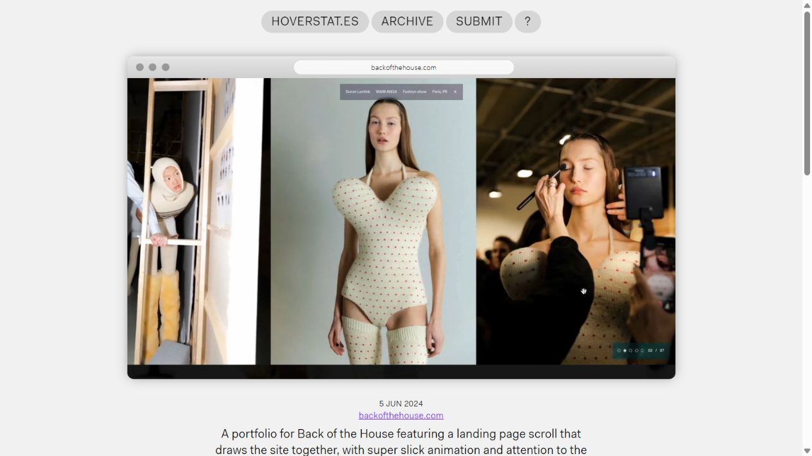

### 5. Bruno Simon — optional experimental study

[Portfolio](https://bruno-simon.com/) · [Older portfolio](https://2019.bruno-simon.com/).

The primary site’s searchable content describes a driveable 3D portfolio and links to its source and behind-the-scenes material. The in-app browser only exposed a sparse loading/canvas state and screenshot capture subsequently failed. **No playable experience was verified and no useful screenshot is included.**

Potential lesson: a portfolio interaction can itself demonstrate skill. For this site, an optional small toy or particle experiment is a more proportionate exploration than making a 3D world the main navigation. Revisit manually if this direction appeals.

## Three directions to explore

| Direction | Visual language | Information structure | Tradeoff |
| --- | --- | --- | --- |
| A — Technical product portfolio, recommended | Near-black, warm white, existing violet; large mixed-case headline; fine rules; real UI imagery | Short intro → ShadowPlay → tools index → profile → contact | Best fit for the current work; requires a little project-story material |
| B — Quiet editorial notebook | Warm white/ink, restrained type, generous margins, one accent | Intro → project summaries → optional build notes → contact | Fast to scan and maintain; less dramatic |
| C — Visual lab | Dark canvas or pale poster field, expressive identity, one playful interaction | Identity toy + immediately visible Work link → visual project gallery → compact index | Most personality; more motion, accessibility and performance work |

Do not combine every reference into one design. First compare the same hero and ShadowPlay content in A and B. Explore C if playfulness is the main priority.

## Suggested page outline for direction A

1. Header: name, Work, About, Contact, GitHub. Keep navigation obvious and modest.
2. Intro: student developer, actual focus areas, one short positioning sentence, View work and Commission request actions.
3. Featured project: ShadowPlay name, what it solves, actual screenshots, current MVP status, platform/stack and repository.
4. Supporting tools: three numbered rows with name, one-line purpose, stack and repository.
5. Profile: existing practical-building story, with factual details only.
6. Contact: clear destinations and accurate commission availability.

Suggested draft copy, for review: “I build practical tools for desktop, mobile, and the web.” Supporting line: “Student developer in Berlin working on local-first apps, automation, and AI experiments.” These are draft formulations of existing site content, not new credentials.

For a future ShadowPlay story, gather an actual short capture of pairing → browsing → downloading; label what works today and what remains MVP. No user counts, performance numbers, testimonials or unsupported platform promises.

## Standalone snippet ideas

Original examples for discussion only; **not installed or tested in the site**. They use plain HTML/CSS and need no additional framework or dependency. Keep the current Vue/Vite architecture unless a later request changes it.

### A. Readable hero scale and anchor positioning

```css
.portfolio-intro {
  width: min(100% - 2rem, 72rem);
  margin-inline: auto;
  padding-block: clamp(3rem, 8vw, 7rem);
}
.portfolio-intro h1 {
  max-width: 16ch;
  font-size: clamp(2.5rem, 1.5rem + 4vw, 5.5rem);
  line-height: 1.04;
  letter-spacing: -0.04em;
}
.portfolio-intro p { max-width: 55ch; line-height: 1.6; }
section[id] { scroll-margin-top: 5rem; }
```

[MDN clamp documentation](https://developer.mozilla.org/en-US/docs/Web/CSS/Reference/Values/clamp) explains bounded fluid sizing; [scroll-margin-top](https://developer.mozilla.org/en-US/docs/Web/CSS/Reference/Properties/scroll-margin-top) supplies an anchor offset. Test zoom and actual header height later.

### B. An evidence-led project block

```html
<article class="project-story" aria-labelledby="shadowplay-heading">
  <div>
    <p>01 / Featured project · Active MVP</p>
    <h2 id="shadowplay-heading">ShadowPlay</h2>
    <p>Find and download finished PC game clips over your own LAN.</p>
    <a href="https://github.com/aoyn1xw/ShadowPlay">View repository ↗</a>
  </div>
  <figure>
    <!-- Use the existing owned screenshot path during implementation. -->
    
    <figcaption>Flutter client · actual application screen</figcaption>
  </figure>
</article>
```

```css
.project-story { display: grid; gap: 2rem; align-items: center; }
.project-story img { display: block; max-width: 100%; height: auto; }
.project-story a:focus-visible { outline: 2px solid #667cff; outline-offset: 5px; }
@media (min-width: 56rem) {
  .project-story { grid-template-columns: 1fr 1fr; }
}
```

The placeholder image path must be replaced; verify actual image dimensions and alt text before use. Keep screenshots legible rather than adding strong perspective distortion.

### C. Optional motion that respects user preferences

```css
.project-preview { transition: transform 180ms ease-out; }
@media (hover: hover) and (pointer: fine) {
  .project-link:hover .project-preview { transform: translateY(-4px); }
}
@media (prefers-reduced-motion: reduce) {
  .project-preview { transition: none; transform: none; }
}
```

[MDN reduced-motion documentation](https://developer.mozilla.org/en-US/docs/Web/CSS/Reference/At-rules/@media/prefers-reduced-motion). This handles the CSS example only; canvas animation needs a separate reduced-motion path. The current particle component already checks that preference in local source—preserve that behavior and verify it when implementing.

## Repository handoff and next-stage boundaries

Local inspection found Vue 3, Vite, TypeScript, an existing shared `tokens.css`, scene components, `src/data/site.ts`, and separate commission HTML/CSS. Useful future entry points: `src/App.vue`, `src/styles/main.css`, `src/components/ShadowPlayScene.vue`, `src/components/ProjectIndexScene.vue`, `src/components/ParticleWordmark.vue`, `commission.css` and `tokens.css`.

The local header includes About and Contact, while the inspected live header exposed Projects and GitHub. Do not assume local source exactly matches production. Existing unrelated changes were present in the deployment workflow, package manifests/lockfiles and worker README before this research. They were left untouched.

Before implementation, select A/B/C, decide how much of the particle identity to keep, and confirm whether project summaries need dedicated pages. Then produce comparable desktop/mobile design studies before changing application files. Later validation should cover keyboard navigation, 200% zoom, narrow screens, reduced motion, anchor destinations and readable screenshots. Preserve commission semantics, acknowledgement gates, privacy wording and actual backend behavior.

## Research access notes

- **Mobbin:** the selected plugin returned “Mobbin MCP requires a paid plan. Upgrade at https://mobbin.com/pricing to continue.” No Mobbin results were retrieved or attributed.
- **Context.dev:** used for public-web search and Emil’s styleguide extraction. Its broad search was noisy; stronger sources were verified directly through browsing and web search.
- **Computer Use:** used the requested in-app browser for current-site and reference interaction. No external submissions or account changes.
- **Context7:** no library-specific implementation guidance was needed for the plain HTML/CSS research examples. Fetch current library documentation before future framework/API work.
- Further discovery: [HOVERSTAT.ES archive](https://www.hoverstat.es/archive/), [Agency Showcase](https://agencyshowcase.co/), [Godly](https://godly.website/). Treat these as discovery directories, not proof of a specific design’s current behavior.

All embedded images are bundled locally. References can change; observations above describe this research session.
